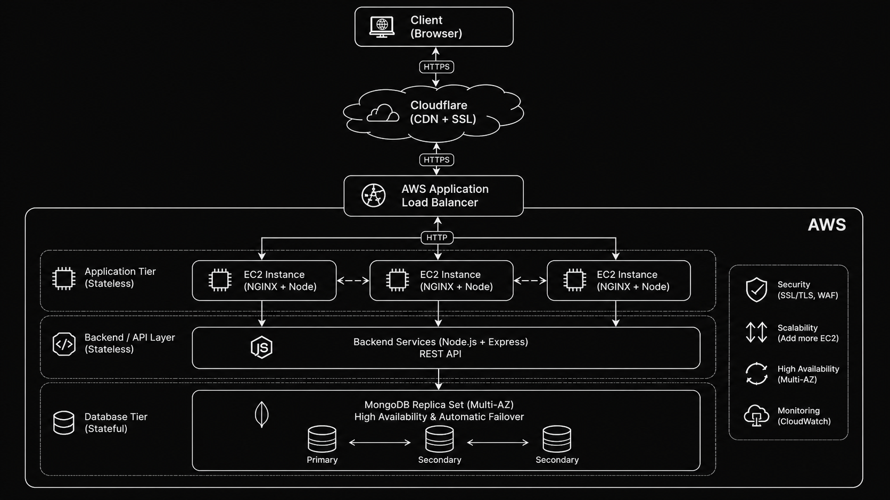

## AWS Infrastructure Setup

- Create two Ubuntu 26.04 LTS EC2 instances in the same VPC:
  - One for the MERN frontend (React).
  - One for the MERN backend (Node.js/Express).
- Use `t3.micro`.
- Configure security groups to allow inbound:
  - SSH (port 22) from your IP.
  - HTTP (port 80) for NGINX.
  - Application ports (e.g., 3000 for frontend, 3001 for backend) for internal testing.
Result


## MERN Application Deployment
### Databse (MongoDB)
1. Create cluster `TravelMemory`
2. Create database `HeroVired`
3. Create collection `TravelMemory`
4. Added sample data
   ```json
   {
       "tripName": "Incredible India",
       "startDateOfJourney": "19-03-2022",
       "endDateOfJourney": "27-03-2022",
       "nameOfHotels":"Hotel Namaste, Backpackers Club",
       "placesVisited":"Delhi, Kolkata, Chennai, Mumbai",
       "totalCost": 800000,
       "tripType": "leisure",
       "experience": "Lorem Ipsum, Lorem Ipsum,Lorem Ipsum,Lorem Ipsum,Lorem Ipsum,Lorem Ipsum,Lorem Ipsum,Lorem Ipsum,Lorem Ipsum,Lorem Ipsum,Lorem Ipsum,Lorem Ipsum,Lorem Ipsum,Lorem Ipsum,Lorem Ipsum,Lorem Ipsum,Lorem Ipsum,Lorem Ipsum,Lorem Ipsum,Lorem Ipsum,Lorem Ipsum,Lorem Ipsum,Lorem Ipsum,Lorem Ipsum,Lorem Ipsum,Lorem Ipsum,Lorem Ipsum, ",
       "image": "https://t3.ftcdn.net/jpg/03/04/85/26/360_F_304852693_nSOn9KvUgafgvZ6wM0CNaULYUa7xXBkA.jpg",
       "shortDescription":"India is a wonderful country with rich culture and good people.",
       "featured": true
   }
   ```
Result

### Backend (Express)

1. SSH into the backend EC2 instance.
2. Install Node.js and npm:
   ```bash
   sudo apt update
   sudo apt install -y nodejs npm
   ```
3. Clone the backend repository:
   ```bash
   git clone https://github.com/Rishav-Mukhopadhyay/aws_assignment_HeroVired.git
   cd aws_assignment_HeroVired/backend
   ```
4. Install dependencies and start the server:
   ```bash
   npm install
   node index.js
   ```
5. Use pm2 to keep the backend alive:
   ```bash
   sudo npm install -g pm2
   pm2 start index.js --name mern-backend
   pm2 save
   pm2 startup systemd
   ```
   
Result


### Frontend (React)

1. SSH into the frontend EC2 instance.
2. Install Node.js and npm:
   ```bash
   sudo apt update
   sudo apt install -y nodejs npm
   ```
3. Clone the frontend repository:
   ```bash
   git clone https://github.com/Rishav-Mukhopadhyay/aws_assignment_HeroVired.git
   cd aws_assignment_HeroVired/frontend
   ```
4. Configure API base URL to point to the backend (later via NGINX/ALB, e.g. `/api`).
5. Install dependencies and start the dev server:
   ```bash
   npm install
   npm start
   ```
6. For production, build the React app and serve it through NGINX or a dedicated Node server:
   ```bash
   npm run build
   ```
Result


## NGINX Reverse Proxy Configuration

Install and configure NGINX on a chosen entry-point instance (often the frontend EC2):

1. Install NGINX:
   ```bash
   sudo apt update
   sudo apt install -y nginx
   ```
2. Edit the default site configuration:
   ```bash
   sudo nano /etc/nginx/sites-available/default
   ```
3. Example configuration:
   ```nginx
   server {
       listen 80;

       location /api {
           proxy_pass http://172.31.9.227:3001;
       }

       location / {
           proxy_pass http://172.31.1.40:3000;
       }
   }
   ```
4. Test and reload:
   ```bash
   sudo nginx -t
   sudo systemctl reload nginx
   ```
Result


## High Availability with AWS Application Load Balancer

1. Launch one or more additional EC2 instances with the same code and configuration.(FrontEnd)
2. Create a Target Group:
   - Type: Instances
   - Protocol: TCP
   - Port: 80
   - Health check path: /addexperience
   - Register all frontend instances.
   
3. Create an Application Load Balancer:
   - Scheme: Internet-facing.
   - At least 3 subnets in different AZs.
   - Listener on port 80 forwarding to the frontend target group.
   
Result


## Secure Hosting with Cloudflare

1. Add your domain to Cloudflare.
2. Update nameservers at your domain registrar to the Cloudflare nameservers.
3. In Cloudflare DNS, create:
   - `A` record for `travelmoney` pointing to your NGINX/entry EC2 public IP (or ALB later).
   - `CNAME` record for `api` pointing to the loadbalancer.
   
4. In Cloudflare SSL/TLS settings:
   - Choose an SSL mode (e.g., Flexible or Full).
   - Enable "Always Use HTTPS" if desired.
Result


## Architechture Diagram

